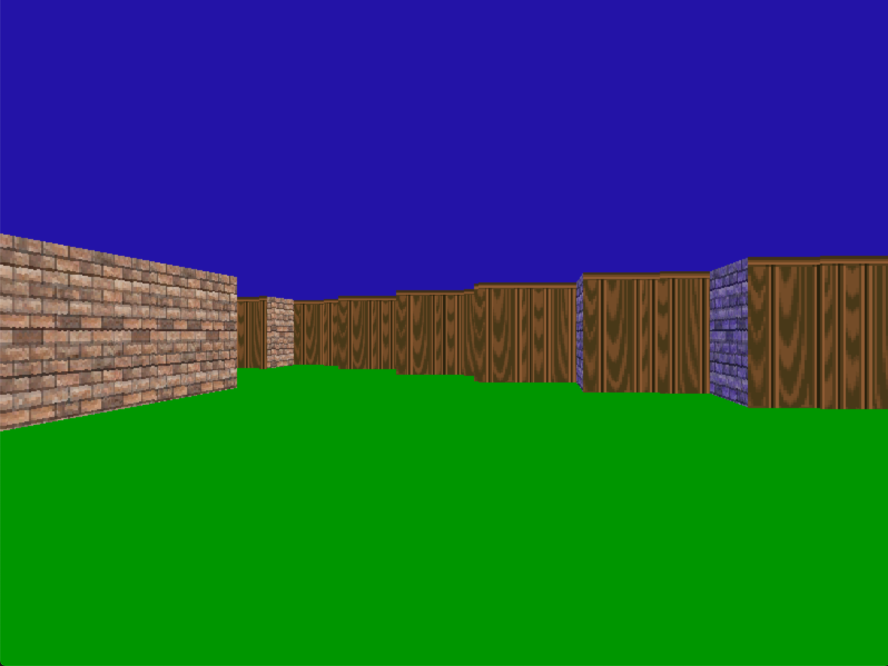
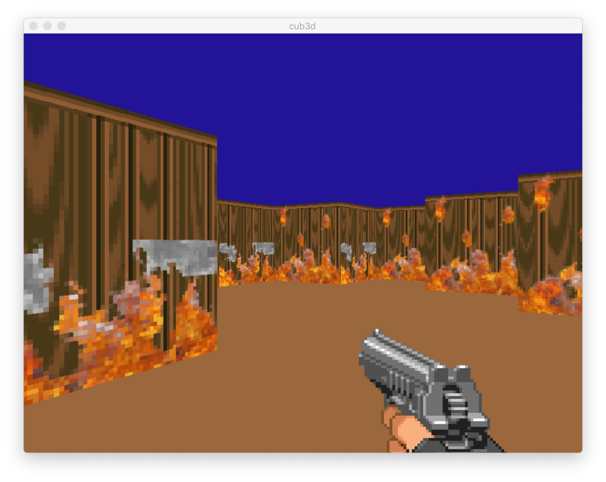
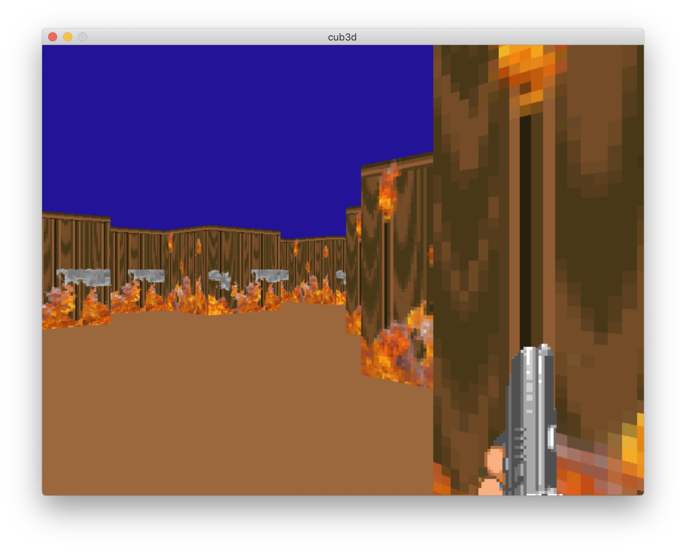

# cub3D
## _Inspired by Wolfenstein 3D_

Cub3D is a RayCaster made with the MiniLibx library.
A map file (.cub) is passed through at launch of program and a 3D environment is 
rendered which allows you to navigate with the WASD buttons as well as using 
left and right buttons to look around. 

The cub3d_bonus file also allows some mouse control plus animations.
Refer to Project Instructions PDF for full requirements of project.


## Installation

For cub3d without bonus, in terminal navigate to project folder where -Makefile- is located and type:

```sh
make
```
then launch program with path to map file
```sh
./cub3d maps/map.cub
```

For cub3d with bonus, in terminal navigate to project folder where -Makefile- is located and type:

```sh
make bonus
```
then launch program with path to map file
```sh
./cub3d_bonus maps/map_animated.cub
```


## Screenshots
cub3D without bonus


cub3D with bonus



